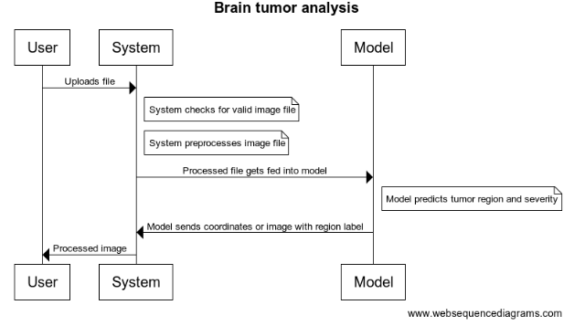

## **Component Specification**

### **Software Components**
Website interface components: Streamlit  
Model training and predicting component: ultralytics.YOLO  
Image preprocessing for model prediction: OpenCV  

#### **Website Interface Component: Streamlit**
A website interface manager, such as Streamlit, allows us to effortlessly create a website or app without requiring an in-depth understanding of frontend development. For the sections of the website that do not involve our model predictions, we simply invoke functions that encapsulate components like sidebars, headers, and markdown, enabling us to display various aspects of the website seamlessly. The input required is an uploaded brain scan from the user. Depending on the delegation of features, the Streamlit site may also run a quick check to ensure that the uploaded file has the correct filetype (jpg, png, etc). The output it produces is the finalized model prediction, along with a dialogue explaining the image. For example, this could include describing what the highlighted regions refer to, what the likelihood (moderate, low, severe) corresponds to, and any of the relevant confidence metrics that the model outputs. Finally, it’ll provide the user with extra information on the models capabilities and where to learn more.

#### **Image Processing Container: OpenCv**
Because a user can upload effectively any type of image, it’s important that there’s an internal system to filter and detect potential issues that arise due to the uploaded file. One solution is to have an internal tool that facilitates the transfer of the image from the user to the model, and then from the model back to the user. The input is the uploaded image from the user. Once captured, we process these images using OpenCV to achieve the desired formats, such as greyscale and resizing, before inputting them into the model for predicting the presence and severity of tumors. Once the container has the model processed image, it’ll potentially resize the image back to its original dimensions and provide any other modifications that are needed to comply with Streamlit’s requirements. 

#### **Model Training and Predicting Component: ultralytics.YOLO**
Ultralytics.YOLO is a highly capable, easy-to-use image segmentation model that we selected to process the uploaded brain scans. It requires an initial training session to establish the best parameters and weights and then needs to be integrated with our Streamlit website, and image preprocessing pipeline.Once trained, it can be utilized to predict unseen images using the best parameters tuned from the provided training images. The input for the model will be an uploaded, preprocessed, brain scan from a user. Then, the model will predict whether or not there is a tumor, the affected regions, and the severity. The output will be a predicted mask overlaid on the original image as well as the confidence metrics for the prediction. 

### Interactions to Accomplish Use Cases

User -> System: Uploads file 
note right of System: System checks for valid image file 
note right of System: System preprocesses image file 
System -> Model: Processed file gets fed into model 
note right of Model: Model predicts tumor region and severity 
Model -> System: Model sends coordinates or image with region label 
System -> User: Processed image

Users can explore our website to access background information on brain tumors, including symptoms and additional resources, by clicking on sidebars and various links embedded throughout the site. For predicting tumor severity based on a brain tumor image, users can conveniently upload their images using the file uploader component on the website. Once uploaded, the image is captured in the backend and undergoes preprocessing, including grayscale conversion and rescaling, before being fed into the pretrained YOLOv8 model. The model then generates predictions, presenting the original image along with bounding box(es) outlining the tumor(s) and their predicted severities. These results are displayed on the website, allowing users to view and delve deeper into the analysis.

